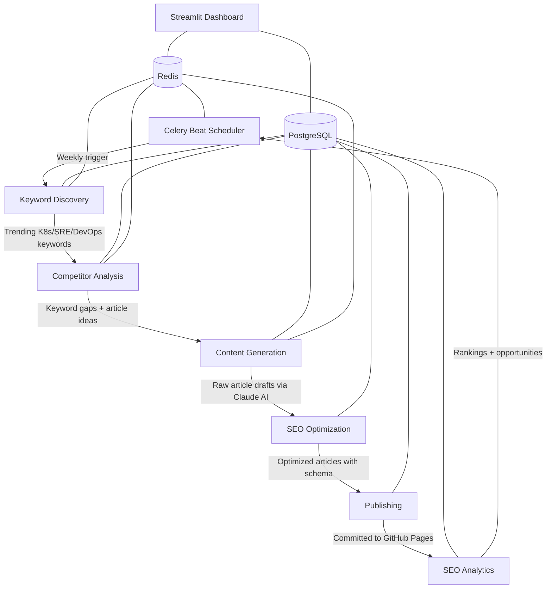

# Kubegraf SEO Automation Platform

An AI-driven, production-grade SEO automation system that automatically discovers keywords, analyzes competitors, generates high-quality technical articles, optimizes for search engines, and publishes to GitHub Pages — all without human intervention.

## Architecture Overview

```
┌─────────────────────────────────────────────────────────────────────────────┐
│                     SEO Automation Pipeline                                  │
│                                                                               │
│  ┌─────────┐    ┌───────────┐    ┌──────────┐    ┌──────────┐              │
│  │Scheduler│───>│  Keyword  │───>│Competitor│───>│ Content  │              │
│  │(Celery) │    │Discovery  │    │Analysis  │    │Generation│              │
│  └─────────┘    └───────────┘    └──────────┘    └──────────┘              │
│                                                          │                   │
│  ┌───────────┐    ┌──────────┐    ┌──────────┐         │                   │
│  │  Analytics │<──│Publishing│<──│   SEO    │<────────┘                   │
│  │            │    │          │    │Optimizer │                             │
│  └───────────┘    └──────────┘    └──────────┘                             │
│                                                                               │
│  ┌─────────────────────────────────────────────┐                            │
│  │         Streamlit Dashboard (Port 8501)      │                            │
│  └─────────────────────────────────────────────┘                            │
│                                                                               │
│  Infrastructure: PostgreSQL + Redis + Celery Beat                            │
└─────────────────────────────────────────────────────────────────────────────┘
```

## Pipeline Data Flow



## Services

| Service | Port | Description |
|---------|------|-------------|
| Scheduler | 8000 | Celery-based pipeline orchestration |
| Keyword Discovery | 8001 | Trending keyword research and scoring |
| Competitor Analysis | 8002 | Competitor keyword gap analysis |
| Content Generation | 8003 | AI article generation via Anthropic Claude |
| SEO Optimization | 8004 | Article optimization and scoring |
| Publishing | 8005 | GitHub Pages publishing via GitHub API |
| Backlink Automation | 8006 | Backlink opportunity identification |
| SEO Analytics | 8007 | Rankings tracking and reporting |
| Dashboard | 8501 | Streamlit monitoring dashboard |

## Target Competitors Tracked

| Competitor | Domain | Category |
|------------|--------|----------|
| Deductive AI | deductive.ai | AI Incident Management |
| Rootly | rootly.com | Incident Management |
| SRE.ai | sre.ai | AI SRE Platform |
| Resolve Systems | resolve.io | IT Automation |
| Incident.io | incident.io | Incident Management |
| Komodor | komodor.com | Kubernetes Ops |
| Dash0 | dash0.com | Observability |
| Harness | harness.io | DevOps Platform |

## Quick Start

### Prerequisites

- Docker and Docker Compose
- Python 3.11+ (for local development)
- Anthropic API key (for content generation)
- GitHub Token (for publishing)

### 1. Clone and Configure

```bash
git clone https://github.com/kubegraf/seo-automation
cd seo-automation

# Copy and configure environment variables
cp .env.example .env
# Edit .env with your API keys
```

### 2. Start with Docker Compose

```bash
# Start all services
make start

# Check status
make status

# View logs
make logs
```

The dashboard will be available at http://localhost:8501

### 3. Run Database Migrations

```bash
make migrate
```

### 4. Trigger the Pipeline

```bash
# Run full pipeline
make pipeline

# Or trigger individual steps
make pipeline-keywords
make pipeline-competitors
make pipeline-content
```

## Docker Compose Setup

```bash
# Start all services
docker compose up -d

# Scale content generation (handles LLM API calls)
docker compose up -d --scale content-generation=3

# View specific service logs
docker compose logs -f content-generation

# Stop everything
docker compose down
```

## Kubernetes Deployment

### Using Helm

```bash
# Add credentials
helm upgrade --install seo-automation ./helm/seo-automation \
  --namespace seo-automation \
  --create-namespace \
  --set secrets.ANTHROPIC_API_KEY="your-key" \
  --set secrets.GITHUB_TOKEN="your-token" \
  --set secrets.DATABASE_URL="postgresql+asyncpg://..." \
  --wait

# Run migrations
kubectl exec -n seo-automation deployment/scheduler -- \
  alembic -c /app/migrations/alembic.ini upgrade head
```

### Using Raw Manifests

```bash
kubectl apply -f k8s/namespace.yaml
kubectl apply -f k8s/configmap.yaml
# Edit k8s/secret.yaml with actual values, then:
kubectl apply -f k8s/secret.yaml
kubectl apply -f k8s/postgres.yaml
kubectl apply -f k8s/redis.yaml
kubectl apply -f k8s/ingress.yaml
```

## Environment Variables

| Variable | Required | Description |
|----------|----------|-------------|
| `ANTHROPIC_API_KEY` | Yes | Claude API key for content generation |
| `DATABASE_URL` | Yes | PostgreSQL connection URL |
| `REDIS_URL` | Yes | Redis connection URL |
| `GITHUB_TOKEN` | Yes | GitHub token for publishing |
| `GITHUB_REPO_OWNER` | Yes | GitHub org/user for content repo |
| `GITHUB_REPO_NAME` | Yes | GitHub repo name for content |
| `SERPAPI_KEY` | No | SerpAPI key for live keyword data |
| `OPENAI_API_KEY` | No | OpenAI fallback for content generation |
| `SITE_URL` | No | Published site URL (default: https://kubegraf.com) |

See `.env.example` for the complete list.

## API Documentation

### Scheduler Service (Port 8000)

```bash
# Trigger full pipeline
POST /trigger/full-pipeline

# Trigger individual steps
POST /trigger/keyword-discovery
POST /trigger/competitor-analysis
POST /trigger/content-generation
POST /trigger/seo-optimization
POST /trigger/publishing

# Get task status
GET /tasks/{task_id}

# List scheduled tasks
GET /scheduled-tasks
```

### Keyword Discovery (Port 8001)

```bash
# Discover keywords
POST /discover
{
  "min_search_volume": 100,
  "max_difficulty": 75,
  "count": 50
}

# Analyze specific keyword
POST /analyze/{keyword}

# List all keywords
GET /keywords?min_score=50&limit=100

# Get seed keywords
GET /seeds
```

### Competitor Analysis (Port 8002)

```bash
# Analyze competitor
POST /analyze
{ "competitor_name": "Komodor" }

# Get keyword gaps
GET /gaps

# Get content calendar
GET /calendar?weeks=4

# Get article ideas for competitor
GET /article-ideas/Komodor
```

### Content Generation (Port 8003)

```bash
# Generate article
POST /generate
{
  "topic": "Kubernetes OOMKilled Fix",
  "keywords": ["kubernetes oomkilled", "oomkilled fix"],
  "article_type": "tutorial",
  "word_count": 2000
}

# Generate comparison article
POST /generate/comparison
{
  "competitor_name": "Komodor",
  "competitor_domain": "komodor.com"
}

# Generate tutorial
POST /generate/tutorial
{
  "topic": "Setting up Kubegraf",
  "steps": ["Install", "Configure", "Test"],
  "primary_keyword": "kubegraf setup"
}

# List generated articles
GET /articles?status=generated&limit=20
```

### SEO Optimization (Port 8004)

```bash
# Optimize specific article
POST /optimize/{article_id}

# Calculate SEO score
POST /score
{ "title": "...", "content": "...", "primary_keyword": "..." }
```

### SEO Analytics (Port 8007)

```bash
# Get rankings
GET /rankings

# Get keyword history
GET /rankings/{keyword}?days=30

# Get weekly report
GET /report

# Get opportunities
GET /opportunities

# Get traffic estimates
GET /traffic
```

## Dashboard

The Streamlit dashboard (http://localhost:8501) provides 4 tabs:

### Articles Tab
- Table of all generated articles with status, word count, SEO score
- Filter by status and minimum SEO score
- Sortable by creation date, SEO score, word count, or clicks
- Article detail view with published URL

### Keywords Tab
- Keyword rankings table with trend indicators (📈📉➡️)
- Search and filter functionality
- Opportunity score visualization
- Position tracking with change indicators

### Competitors Tab
- Competitor cards with traffic estimates and domain authority
- Keyword gap lists per competitor
- One-click competitor analysis trigger
- One-click comparison article generation
- Keyword gap bar chart

### Analytics Tab
- Organic traffic trend line charts (30-day view)
- Top performing articles table
- SEO opportunity recommendations
- Weekly report summary

## Example Article Topics

The system auto-generates articles on these topics:

1. "AI Root Cause Analysis for Kubernetes: How Kubegraf Automates Incident Investigation"
2. "Automatic Kubernetes Incident Remediation with SafeFix"
3. "AI SRE Platforms Comparison 2024: Kubegraf vs Komodor vs Deductive AI"
4. "How AI Can Fix Production Kubernetes Incidents in Minutes"
5. "Kubernetes Troubleshooting Automation: From Alert to Fix"
6. "Kubegraf vs Rootly: Which Incident Management Platform is Right for You?"
7. "Kubernetes OOMKilled: Automatic Detection and Remediation"
8. "CrashLoopBackOff Root Cause Analysis with AI"
9. "Prometheus Alert to Auto-Remediation: The Complete Guide"
10. "Building a Kubernetes AI SRE Stack"

## Competitor Analysis Summary

The platform tracks and creates content to compete with 8 primary competitors:

- **Komodor** (komodor.com) - Kubernetes change intelligence platform. Our advantage: AI-powered root cause analysis vs their manual debugging approach.
- **Incident.io** (incident.io) - Incident management platform. Our advantage: Kubernetes-native vs generic incident tooling.
- **Rootly** (rootly.com) - Slack-native incident management. Our advantage: Automated remediation (SafeFix) vs manual runbooks.
- **Deductive AI** (deductive.ai) - AI incident analysis. Our advantage: Full platform including remediation vs analysis-only.
- **Dash0** (dash0.com) - OpenTelemetry platform. Our advantage: AI-powered insights vs raw observability data.

## Makefile Commands

```bash
make help          # Show all available commands
make start         # Start all services
make stop          # Stop all services
make build         # Build Docker images
make push          # Push images to registry
make deploy        # Deploy to Kubernetes via Helm
make migrate       # Run database migrations
make test          # Run test suite
make lint          # Run linters
make format        # Auto-format code
make health        # Check all service health
make pipeline      # Trigger full pipeline
make status        # Show Docker Compose status
```

## Scheduled Jobs

| Schedule | Task |
|----------|------|
| Monday 2 AM UTC | Full pipeline (keyword → competitor → content → publish) |
| Daily 4 AM UTC | Keyword discovery update |
| Daily 6 AM UTC | Rankings check |
| Sunday midnight UTC | Competitor analysis refresh |

## CI/CD Workflows

### seo-pipeline.yml
Runs weekly (Monday 2 AM UTC) or on manual dispatch:
1. Keyword Discovery → saves artifact
2. Competitor Analysis → (depends on keywords)
3. Content Generation → (depends on competitors)
4. SEO Optimization → (depends on content)
5. Publishing → (depends on optimization)
6. Analytics Update → always runs

### deploy.yml
Triggers on push to main:
1. Detect changed services
2. Build changed Docker images in parallel
3. Run test suite
4. Deploy to Kubernetes via Helm
5. Run database migrations
6. Smoke test verification

## Development

```bash
# Install all dependencies
make install

# Run tests
make test

# Lint code
make lint

# Format code
make format

# Open PostgreSQL shell
make shell-db

# Open scheduler container shell
make shell-scheduler
```

## Architecture Decisions

- **Python 3.11** with async/await throughout for performance
- **FastAPI** for all services — fast, type-safe, auto-documented
- **Celery + Redis** for distributed task scheduling
- **SQLAlchemy 2.0 async** for database operations
- **Anthropic Claude** as primary LLM for high-quality technical content
- **Pydantic v2** for data validation
- **httpx** for async HTTP client
- **Streamlit** for rapid dashboard development

## License

Copyright 2024 Kubegraf. All rights reserved.
